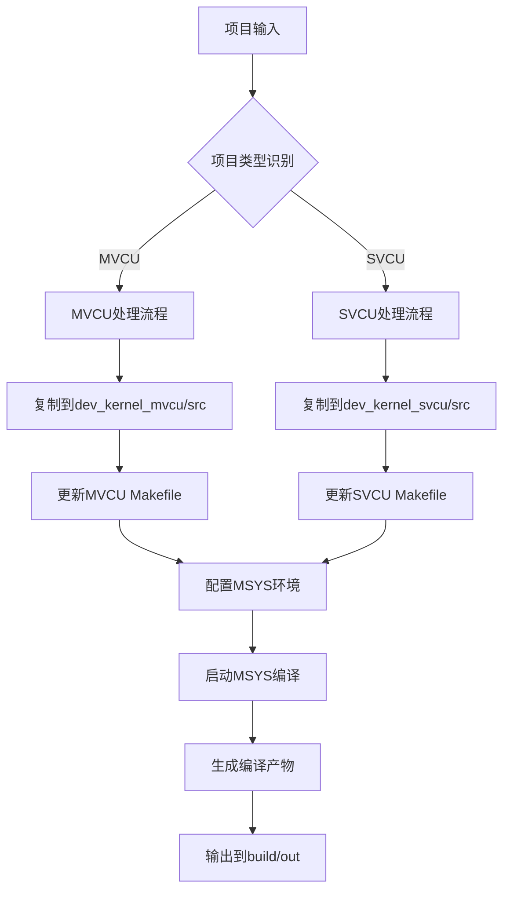

# 🏗️ LOC_COMPILE 架构文档

## 📋 概述

LOC_COMPILE 是一个用于简化 VCU (Vehicle Control Unit) 项目编译流程的工具，支持 MVCU 和 SVCU 两种类型的项目。该工具提供图形界面和命令行两种操作模式，自动管理编译环境、工具链配置和构建流程。

## 🏛️ 整体架构

### 架构层次

```
┌─────────────────────────────────────────────────────────────┐
│                    用户交互层                                │
├─────────────────────┬───────────────────────────────────────┤
│   GUI模式            │         命令行模式                    │
│ (vcu_compiler_ui.py) │      (main.py --console)             │
└─────────────────────┼───────────────────────────────────────┘
                      │
┌─────────────────────┴───────────────────────────────────────┐
│                    核心业务层                                │
├─────────────────────────────────────────────────────────────┤
│  • 项目类型识别    • 环境配置    • 编译器管理    • 文件处理  │
│  • 路径管理       • MSYS集成    • 构建流程控制              │
└─────────────────────────────────────────────────────────────┘
                      │
┌─────────────────────┴───────────────────────────────────────┐
│                   工具链集成层                               │
├─────────────────────────────────────────────────────────────┤
│  GCC工具链     ColdFire编译器(CW)     MSYS环境              │
└─────────────────────────────────────────────────────────────┘
                      │
┌─────────────────────┴───────────────────────────────────────┐
│                    文件系统层                                │
├─────────────────────────────────────────────────────────────┤
│  源码目录      构建目录      输出目录      配置文件          │
└─────────────────────────────────────────────────────────────┘
```

## 🧩 核心组件

### 1. 主程序入口 (`main.py`)

**职责**：
- 应用程序启动和模式选择
- 命令行参数解析
- 项目结构初始化
- 编译器路径配置

**核心功能**：
```python
def main():
    # 解析命令行参数
    # 确保项目结构存在
    # 选择GUI或命令行模式
    # 初始化编译环境
```

**关键方法**：
- `ensure_project_structure()` - 创建项目目录结构
- `update_makefiles_with_correct_paths()` - 更新编译器路径
- `update_msys_profile()` - 配置MSYS环境
- `process_in_console_mode()` - 命令行模式处理

### 2. 图形用户界面 (`vcu_compiler_ui.py`)

**职责**：
- 提供可视化操作界面
- 用户交互和反馈
- 实时日志显示
- 编译进度监控

**界面组件**：
- 项目选择区域
- 编译选项配置
- 实时日志显示
- 进度指示器
- 快捷操作按钮

### 3. 路径工具 (`path_utils.py`)

**职责**：
- 跨平台路径处理
- 开发/打包环境适配
- 资源文件定位

**核心函数**：
```python
def get_application_path():
    # 获取应用程序运行目录
    
def get_resource_path(*path_parts):
    # 获取资源文件路径，兼容PyInstaller
```

### 4. 构建系统 (`scripts/build_exe.py`)

**职责**：
- 项目打包为可执行文件
- 依赖项管理
- 资源文件包含
- 发布包生成

## 🔄 数据流架构

### 项目处理流程



### 编译环境配置流程


## 📁 目录结构设计

### 工具源码结构
```
LOC_COMPILE/
├── main.py                 # 主程序入口
├── vcu_compiler_ui.py      # GUI界面实现
├── path_utils.py           # 路径工具函数
├── requirements.txt        # 依赖包清单
├── setup_env.py           # 环境设置脚本
├── doc/                   # 文档目录
│   ├── architecture.md    # 架构文档
│   ├── api/              # API文档
│   ├── developer/        # 开发者文档
│   ├── user_guide/       # 用户指南
│   └── troubleshooting/  # 故障排除
└── scripts/              # 构建脚本
    ├── build_exe.py      # 打包脚本
    ├── safe_pull.py      # 安全拉取
    └── safe_push.py      # 安全推送
```

### 运行时目录结构
```
项目根目录/
├── LOC_COMPILE.exe        # 主程序
├── GCC/                   # GCC工具链
│   ├── bin/              # 可执行文件
│   ├── lib/              # 库文件
│   └── include/          # 头文件
├── CW/                    # ColdFire工具链
│   └── ColdFire_Tools/
│       └── Command_Line_Tools/
├── MSYS-1.0.10-selftest/ # MSYS环境
│   └── 1.0/
│       ├── bin/
│       └── etc/
└── VCU_compile - selftest/ # 工作目录
    ├── dev_kernel_mvcu/   # MVCU项目
    │   ├── src/          # 源码目录
    │   ├── build/        # 构建目录
    │   └── build/out/    # 输出目录
    └── dev_kernel_svcu/   # SVCU项目
        ├── src/          # 源码目录
        ├── build/        # 构建目录
        └── build/out/    # 输出目录
```

## 🔧 技术栈

### 核心技术
- **Python 3.6+** - 主要开发语言
- **Tkinter** - GUI框架
- **Threading** - 多线程处理
- **Subprocess** - 外部工具调用
- **PyInstaller** - 打包工具

### 外部依赖
- **GCC工具链** - C/C++编译器
- **ColdFire工具** - 专用编译器
- **MSYS环境** - Unix-like环境模拟

### 开发工具
- **Git** - 版本控制
- **Visual Studio Code** - 推荐IDE
- **Python虚拟环境** - 依赖隔离

## 🎯 设计模式

### 1. 策略模式 (Strategy Pattern)
用于处理不同的VCU项目类型：
```python
class VCUProcessor:
    def process_mvcu(self, source_path):
        # MVCU特定处理逻辑
        
    def process_svcu(self, source_path):
        # SVCU特定处理逻辑
```

### 2. 观察者模式 (Observer Pattern)
用于GUI和后台处理的通信：
```python
def update_makefiles_with_correct_paths(callback=None):
    # 通过callback向GUI发送进度更新
    if callback:
        callback(message, is_error)
```

### 3. 模板方法模式 (Template Method)
用于标准化的编译流程：
```python
def standard_compile_process():
    # 1. 验证环境
    # 2. 复制源码
    # 3. 更新配置
    # 4. 执行编译
    # 5. 收集输出
```

## 🔒 安全性设计

### 路径安全
- 路径规范化处理
- 防止路径遍历攻击
- 文件权限检查

### 输入验证
- 文件类型检查
- 项目名称验证
- 路径有效性验证

### 错误处理
- 异常捕获和记录
- 优雅的失败处理
- 用户友好的错误提示

## 📈 性能优化

### 文件操作优化
- 使用 `robocopy` 进行高效文件复制
- 避免重复的文件系统检查
- 批量处理文件操作

### 并发处理
- GUI与后台处理分离
- 异步任务执行
- 线程安全的日志记录

### 内存管理
- 及时释放大对象
- 避免内存泄漏
- 优化字符串处理

## 🔮 扩展性设计

### 插件架构
预留插件接口，支持：
- 自定义编译器
- 扩展项目类型
- 自定义构建步骤

### 配置系统
- 外部配置文件支持
- 用户自定义设置
- 环境变量配置

### API接口
- 命令行接口
- 程序化调用接口
- REST API（未来扩展）

## 🧪 测试策略

### 单元测试
- 核心功能模块测试
- 路径处理函数测试
- 错误处理测试

### 集成测试
- 端到端编译流程测试
- GUI交互测试
- 工具链集成测试

### 兼容性测试
- 不同Windows版本测试
- 不同Python版本测试
- 各种项目结构测试

## 📝 维护性设计

### 代码组织
- 模块化设计
- 清晰的职责分离
- 统一的编码规范

### 文档体系
- 架构文档
- API文档
- 用户指南
- 故障排除指南

### 版本管理
- 语义化版本控制
- 变更日志维护
- 向后兼容性保证

## 🔧 部署架构

### 开发环境
```bash
# 克隆项目
git clone <repository>

# 安装依赖
pip install -r requirements.txt

# 运行开发版本
python LOC_COMPILE/main.py
```

### 生产环境
```bash
# 打包为可执行文件
python LOC_COMPILE/scripts/build_exe.py

# 分发release包
# 包含所有必要的工具链和依赖
```

### 持续集成
- 自动化测试
- 自动化打包
- 版本发布管理

---

## 📞 联系信息

如需了解更多架构细节或参与开发，请参考项目文档或联系开发团队。